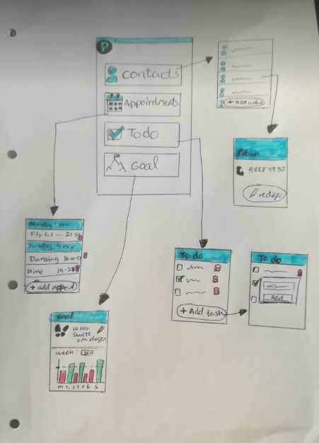

# Dokumentasjon

##  Innhold og funksjonalitet på siden
Siden vår består av en oversiktsside med knapper til hver av undersidene. Hver av knappene har en liten emoji som skal representere hva den tilhørende siden går ut på. Vi har tre undersider: todo, goal og contact.

#### Todo
På todo-siden skal man kunne legge til og slette gjøremål. Å legge til gjøremål foregår ved å skrive en tekst i tekstfeltet og trykke på pila på tastaturet når man er ferdig. Hvis du ikke har skrevet inn noe i feltet, vil du heller ikke kunne legge til et nytt gjøremål. Når man har lagt til gjøremål vises disse i en liste, og kan slettes ved å trykke på søppelikonet ved siden av det representative gjøremålet. Går man ut av appen eller tilbake til hjemmesiden, blir de gjøremål som er valgt lagret og man vil få opp de lagrede gjøremålene når man går tilbake til todosiden. 

#### Goal
På goal-siden kan man sette et mål for hvor mange skritt man ønsker å gå i løpet av en dag. Default verdien for hvor mange skritt man har lyst til å gå er satt til 10 000. Hvis man vil endre på dette kan man sette et nytt mål ved å skrive en ny verdi i tekstfeltet og trykke på pila på tastaturet. Hvor mange skritt du har gått hentes fra skrittelleren på mobilen din. Hvis du ikke har nådd målet for hvor mange skritt du har lyst til å gå vil skrittene vises i en blå sirkel, og når du når målet ditt vil det vises i en grønn sirkel. 

#### Contact
På contact-siden har man mulighet til å opprette kontakter med navn og telefonnummer. Disse lagres i appen slik at du alltid har kontaktene, selv når appen avsluttes og åpnes igjen. For å legge til en ny kontakt, trykker man på "add contact". Da kommer man til en ny side hvor man fyller inn navn og nummer og trykker "save" for å lagre eller "close" for å gå tilbake til kontaktsiden. Man kan også slette kontakter som er opprettet, disse er da borte for godt.

#### Mockups
Her er noen mockups vi lagde før vi startet. Hovedstrukturen er den samme, men vi har valgt å gjøre litt endringer fordi tiden ikke strakk til. Vi har blant annet ikke laget en side for appointments og Goal-sida har heller ikke et stolpediagram



## Bruk av teknologi

#### Bibiloteker
Vi har brukt expo-cli og expo init for komme igang med prosjektet. Av tredjepartskomponenter og bibliotek har vi brukt native-base og react-navigation. Vi skulle egentlig bruke react-native-elements og react-native-vector-icons for ikoner, men dette fungerte ikke. Vi var på sal for å prøve å få hjelp, men ingen av studassene som satt der klarte å hjelpe oss og ga oss dermed tips om å bruke emojis istedenfor, noe som er litt uheldig siden litt av oppgaven også var å benytte seg av tredjepartskomponenter, men siden dette var noe selv studassene ikke klarte å fikse, mener vi det burde være greit. 

#### Expo-api'et
På goal-siden har vi brukt pedometer fra Expo-api'et. Denne bruker Core Motion (iOS) eller Google Fit (Android) for å hente ut antall skritt som er gått av brukeren. For å bruke dette må man importere 'Expo from expo' og 'Pedometer from expo'. Deretter kan man bruke isAvailableAsync()-funksjonen, som returnerer true eller false ut i fra om pedometeret er tilgjenglig for den enheten appen kjøres. Videre henter man ut skritt ved å bruke funksjonen getStepCountAsync(start, end), hvor start og end er det intervallet du ønsker skritt returnert fra. 

#### AsyncStorage
I både todo, goals og contacts har vi brukt AsyncStorage. Dette er react natives api for å lagre data fra appen slik at man får opp igjen de samma dataene selv om appen lukkes. Data lagres i key-value par. Når man har en verdi man vil lagre kan man kalle AsyncStorage.setItem(key, value). Her bestemmer man en key som skal assosieres med den verdien man vil lagre, i tillegg til verdien. For å hente ut igjen denne verdien kaller man AsyncStorage.getItem(key).  


## Tutorial
Disse instruksjonene vil gjøre at du får en kopi av prosjektet oppe og går på din lokale maskin for utvikling. 

### Forutsetninger
Dette er software du må installere for å kjøre prosjektet på din maskin og hvordan du installerer det


#### Step 1: Klon prosjektet fra github og naviger til mappen du klonet prosjektet i

```
git clone https://github.com/IT2810/it2810-webutvikling-h18-prosjekt-3-22.git
```

#### Step: 2 Installer npm
Du trenger Node.js (versjon 6 eller nyere) installert på maskinen din.
[Last ned den nyeste versjonen av Node.js](https://nodejs.org/en/)

Du kan installere npm ved å kjøre:
```
npm install
```

 
#### Step: 3 Installer Expo CLI
Expo CLI er et verktøy for å utvikle apper med expo.

Du kan installere Expo CLI ved å kjøre:

```
npm install -g expo-cli
```


### Installering
En step by step prosess som forteller deg hvordan du installerer alle dependencies

#### Step 1: Installer react-navigation

React-navigation er et bibilotek for routing, som gjør det enkelt navigere mellom de ulike sidene. Fordi vi bruker react-navigation får vi derfor opp en tilbake knapp når man er inne på en av undersidene, slik at man lett kan komme tilbake til hovedsiden
```
npm install react-navigation --save
```

#### Step 2: Installer native-base

Native-base er et bibilotek som gjør det enkelt å lage UI komponenter.

```
npm install native-base --save
```

Vi hadde som sagt også tenkt til å ta i bruk react-native-vector-icons, men dette funket ikke selv etter hjelp fra studass. Derfor har vi ikke fått brukt like mange tredjepartsbibilotek som egentlig var planen

### Kjør programmet

Hvis alt går som forventet og du ikke får noen error kan du kjøre programmet

```
expo start
```
For å få opp prosjektet på mobilen kan du blant annet laste ned appen expo og enten scanne QR koden eller trykke på prosjektet som kommer opp under "Recently in development"

## Testing
Testene ble utviklet med bruk av Jest. Da vi først fikk prosjektet, skulle vi lage testene med både Jest og Enzyme, men bruk av Enzyme sammen med Jest viste seg å være en utfordring. Vi hadde ikke mulighet til å kjøre noen tester med ‘run test’ kommandoen, og gikk derfor til studass for veiledning rundt problemet. Studass hadde ikke skrevet tester tidligere, men informerte om at Enzyme ikke skulle brukes til dette prosjektet allikevel. Det førte til at vi ikke fikk testet så veldig mye mer enn snapshots, men vi har også lagt inn tester på om elementene inne på hver page er tilgjengelig, ved hjelp av en ‘testID’ på hvert element. Før vi fikk vite at Enzyme ikke skulle brukes, hadde vi plan om å skrive tester som faktisk sjekket funksjonaliteten til hvert element, f.eks at dersom man trykket på To Do-knappen, kunne vi forvente at den gikk inn på To Do-siden. Dessverre ble det ikke slik, og vi ble fortalt av studass at det kun var nødvendig med snapshot-testing.
Da vi endret designet med native-base, fungerte plutselig ikke testene lengre. Etter mye googling fant vi ut at Jest og Native-Base ikke er kjempegode venner foreløpig, men at det finnes en snarvei. Snarveien var å legge følgende i package.json-filen.

```
"transformIgnorePatterns": [
"node_modules/(?!react-native|expo|react-navigation|native-base|@shoutem/theme|@shoutem/animation|@shoutem/ui|tcomb-form-native)"]
```

For å kjøre testene må følgende skrives inn i terminalen:

```
npm install --save-dev jest jest-expo babel-jest jest-react-native babel-preset-env babel-preset-react-native react-test-renderer 
```

Etter at alle dependencies er lastet ned skrives følgende i terminalen for å faktisk kjøre testene:

```
npm test
```


Ellers har vi testet koden underveis på både Android og ios, da vi har vært heldige med å ha begge typer telefoner i gruppa. Det har vist seg at det er noen designforskjeller på de to plattformene, og vi har også opplevd at noen funksjoner har vært vanskeligere å implementere på en av plattformene enn den andre. Slike problemer har heldigvis blitt løst underveis, uten for mye frustrasjon.


## Samarbeid, bruk av git, koding og leveranse
Gjennom hele prosjektet har gruppa brukt git og github for å dele kode og holde oversikt over issues. Ved hjelp av github sitt trelloboard har vi hatt et oversiktlig og fint sted for å legge til oppgaver som skulle gjøres, se hvem som jobber med hva og hva som er fullført. I begynnelsen av prosjektet laget vi en del issues ut i fra hvilke funksjonalitet vi ville ha med i appen vår. Dette ble utgangspunktet for prosjektet. Når noen begynte å jobbe med en issue satte man seg opp på denne, slik at hele gruppa kunne se det, og ikke jobbe med det samme. Issues ble også flyttet fra todo til in progress når de ble påbegynt, og til done når de var merget inn. Hver issue har fått en egen branch med navn "feat-'issuenummer'-'tittel'", og hver commit til en branch med melding "#issuenummer beskrivelse". Når en issue var ferdig laget vi en pull request på github hvor de andre kunne se over at alt fungerte som det skulle før det ble merget inn i development-branchen.

